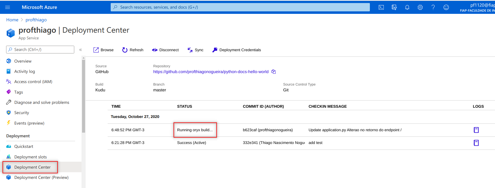

# Criação de App Services na Azure

Este tutorial ensina como criar um App Services na Azure. Para a sua realização você deverá ter uma conta no github. Caso ainda não tenha, você pode criá-la gratuitamente através do link www.github.com, conforme imagem abaixo:


Após seguir alguns passos de configuração e validar seu e-mail, sua conta estará totalmente funcional.

## Fork do repositório base

Estando logado em sua conta no github, acesse o repositório abaixo através de seu web browser e faça um fork do projeto. Este projeto será utilizado como base neste tutorial.

(https://github.com/thiagonogueira/python-docs-hello-world/)


Após o fork do projeto você terá criado um projeto igual ao repositório base em sua própria conta:


## Criação do APP Services na Azure

1. Acesse o seu portal na Azure e, através do menu na lateral esquerda, clique em **App Services**

    

2. Clique no botão **Create App Services**

    

3. Preencha o formulário de acordo com as instruções abaixo:
    -   Selecione uma subscrição válida;
    -   Selecione um Resource Group ou crie um novo;
    -   Deixe o campo publish em **Code**;
    -   Em **Runtime Stack** selecione **Python 3.8**;
    -   Deixe o campo **Operating System** marcado com **Linux**;
    -   Escolha uma região de sua preferência no campo **Region**
    -   Em SKU e size, certifique-se de que está selecionado **Free F1**

    Ao final, clique no botão **Review + create**

    

4. Revise as configuraçõe e clique no botão **Create**

    

5. Durante alguns minutos você verá uma tela informando que o deployment está em progresso e se tudo der certo a tela abaixo será apresentada. Clique em **Go to resource** para continuar:

    


## Fazer o Deployment da Solução

1. Na nova tela, clique no menu **Deployment Center**. Aproveite também para anotar a url de sua aplicação, conforme a figura abaixo:

    

2. Clique na caixa github:

   

3. Uma tela de autorização se abrirá. Clique no botão **Authorize AzureAppService**:

   

4. De volta à tella anterior, pressione o botão **Continue** (Talvez você tenha que atualizar a página para ver este botão):

   

5. Clique na caixa **App Service build service** e depois no botão **Continue**

   

6. Escolha o repositório e a branch correta. Posteriormente clique no botão **Continue**:

    

7. Clique no botaão **Finish**:

    

8. Aguarde até que o processo de deployment finalize e o status apareça como **Success**

    

9. Acesse a url de sua aplicação e verifique que sua página está no ar:

    

## Alterando o seu projeto

Para fins didáticos, faremos uma alteração no repositório a partir da interface web do github. É importante ter em mente que a maneira correta de fazer alterações em repositórios é fazendo um clone para a sua máquina para fazer as alterações localmente. Depois de testar suas alterações, você deverá rodar os comandos de commit (para publicar as alterações) seguido de push (para enviar suas alterações para o repositório central)

1. Acesse o seu repositório a partir do web browser e selecione o arquivo **application.py**. Note que vc deverá ajustar a url para o seu repositório pessoal:

   

2. Clique no botão para habilitar a edição do arquivo:

    

3. Altere a linha 8 do arquivo, substituindo seu conteúdo pelo conteúdo abaixo (tome cuidado para manter a mesma identação):

    ```
        return test.ret_message()
    ```
O arquivo deverá ficar da seguinte maneira:
    

4. Role até o final da página, Adicione uma mensagem de commit e clique no botão **Commit changes**:

   

5. No portal da Azure, reotrne ao menu **Deployment Center** e note que um novo deploy sendo feito automaticamente:
   

6. Aguarde o final do deployment e acesse novamente sua página web. Você deverá notar que ela foi atualizada automaticamente:

   