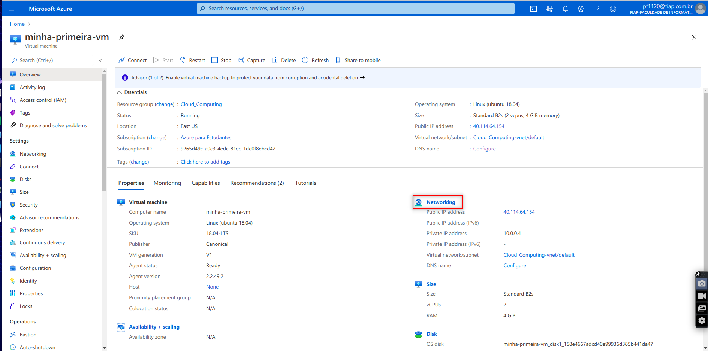
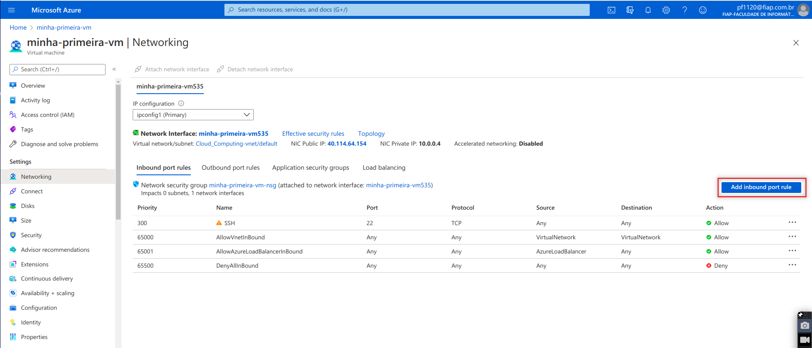
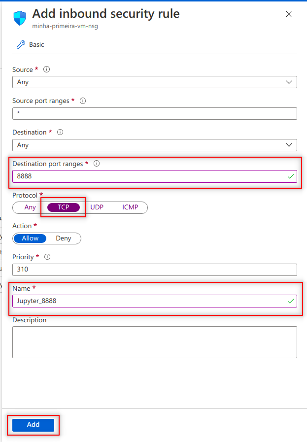
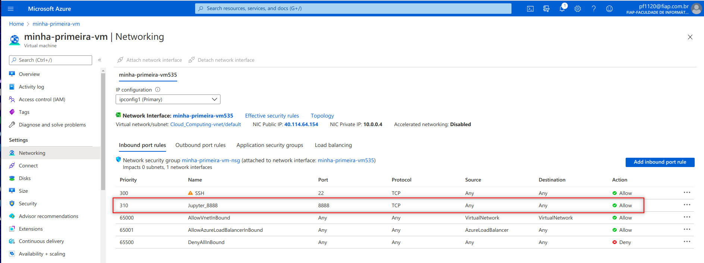
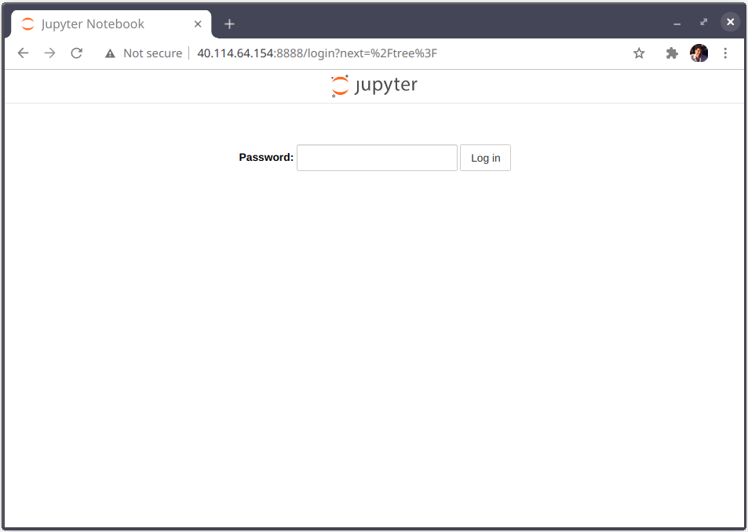

# Treinamento: Criação de VM para equipes na Azure

Neste trinamento vamos criar uma VM na Azure que permita a colaboração de diversos usuários em um ambiente cloud para desenvolvimento de um projeto em Python. Ao final do treinamento, você e a sua equipe deverão ser capazes de acessar a VM tanto via **terminal** quanto via **Jupyter Notebook** para sedenvolvimento do projeto. Tudo pronto? Então, mãos à obra!

## Criar a VM na Azure

Para criar a instância na Azure, siga os passos apresentados no tutorial [**Criar VM na Azure**](azure_criar_vm.md)

##  Instalar o Anaconda na VM

Para instalar e configurar o anaconda na VM vc deve acessá-la via SSH e executar os comandos abaixo.

1. Baixe o  pacote de instalação do Anaconda:

   ```
   $ wget https://repo.anaconda.com/archive/Anaconda3-2020.07-Linux-x86_64.sh
   --2020-10-05 02:45:56--  https://repo.anaconda.com/archive/Anaconda3-2020.07-Linux-x86_64.sh
   Resolving repo.anaconda.com (repo.anaconda.com)... 104.16.130.3, 104.16.131.3, 2606:4700::6810:8303, ...
   Connecting to repo.anaconda.com (repo.anaconda.com)|104.16.130.3|:443... connected.
   HTTP request sent, awaiting response... 200 OK
   Length: 576830621 (550M) [application/x-sh]
   Saving to: ‘Anaconda3-2020.07-Linux-x86_64.sh’
   
   Anaconda3-2020.07-Linux-x86_64.sh              100%[====================================================================================================>] 550.11M   241MB/s    in 2.3s    
   
   2020-10-05 02:45:58 (241 MB/s) - ‘Anaconda3-2020.07-Linux-x86_64.sh’ saved [576830621/576830621]
   ```

2. Rode o instalador do Anaconda:
    ```
    $ sh Anaconda3-2020.07-Linux-x86_64.sh 
    

    Welcome to Anaconda3 2020.07

    In order to continue the installation process, please review the license
    agreement.
    Please, press ENTER to continue
    >>> 

    ```
    
3. Precione ENTER e aperte a barra de espaço até chegar ao final da licença. Aceite a licença escrevendo *yes* no terminal e pressionando ENTER novamente.

      ```
      pynacl
          A Python binding to the Networking and Cryptography library, a crypto library with the stated goal of improving usability, security and speed.

      Last updated May 20, 2020

      Do you accept the license terms? [yes|no]
      [no] >>> yes
      ```

  4. Aceite o local sugerido de instalação pressionando ENTER:

     ```
     Anaconda3 will now be installed into this location:
     /home/pf1120/anaconda3
     
       - Press ENTER to confirm the location
       - Press CTRL-C to abort the installation
       - Or specify a different location below
     
     [/home/pf1120/anaconda3] >>> 
     PREFIX=/home/pf1120/anaconda3
     Unpacking payload ...
     ```
     
5. O instalador levará um tempo fazendo a instalação. Ao final, será penguntado se você deseja inicializar o Anaconda3 rodando o conda init. Responda *yes* a esta questão:
    ```
    yapf               pkgs/main/noarch::yapf-0.30.0-py_0
    zeromq             pkgs/main/linux-64::zeromq-4.3.2-he6710b0_2
    zict               pkgs/main/noarch::zict-2.0.0-py_0
    zipp               pkgs/main/noarch::zipp-3.1.0-py_0
    zlib               pkgs/main/linux-64::zlib-1.2.11-h7b6447c_3
    zope               pkgs/main/linux-64::zope-1.0-py38_1
    zope.event         pkgs/main/linux-64::zope.event-4.4-py38_0
    zope.interface     pkgs/main/linux-64::zope.interface-4.7.1-py38h7b6447c_0
    zstd               pkgs/main/linux-64::zstd-1.4.5-h0b5b093_0

    Preparing transaction: done
    Executing transaction: done
    installation finished.
    Do you wish the installer to initialize Anaconda3
    by running conda init? [yes|no]
    [no] >>> yes

    ```

6. O instalador deverá finalizar a instalação com êxito. Para iniciar o Anaconda sem precisar fechar sua sessão e abrir uma outra, digite o seguinte comando:

   ```
   pf1120@minha-primeira-vm:~$ source .bashrc
   (base) pf1120@minha-primeira-vm:~$
   ```

   Note que agora há a palavra (base) no início da linha do prompt. Isso indica que o Anaconda está carregado com o ambiente *base* ativado

## Criar e configurar um novo ambiente (env) no Anaconda

1. Agora vamos criar um novo ambiente no anaconda com python 3.8 chamado fiap:

   ```
   (base) pf1120@minha-primeira-vm:~$ conda create -n fiap python=3.8
   ```

2. Uma série de informações sobre os pacotes a serem instalados aparecerá na tela e será solicitado que você confirme que quer proceder. Aperte ENTER para confirmar:

   ```
   Proceed ([y]/n)? 
   
   
   Downloading and Extracting Packages
   wheel-0.35.1         | 37 KB     | ########################################### | 100% 
   openssl-1.1.1h       | 2.5 MB    | ########################################### | 100% 
   pip-20.2.3           | 1.7 MB    | ########################################### | 100% 
   ca-certificates-2020 | 125 KB    | ########################################### | 100% 
   setuptools-49.6.0    | 742 KB    | ########################################### | 100% 
   python-3.8.5         | 49.3 MB   | ########################################### | 100% 
   sqlite-3.33.0        | 1.1 MB    | ########################################### | 100% 
   Preparing transaction: done
   Verifying transaction: done
   Executing transaction: done
   #
   # To activate this environment, use
   #
   #     $ conda activate fiap
   #
   # To deactivate an active environment, use
   #
   #     $ conda deactivate
   
   (base) pf1120@minha-primeira-vm:~$ 
   ```

3. Ative o novo ambiente:

    ```
    (base) pf1120@minha-primeira-vm:~$ conda activate fiap
    (fiap) pf1120@minha-primeira-vm:~$ 
    ```

4. Inicialmente, vamos instalar o Jupyter e o pandas neste ambiente, mas posteriormente você provavelmente terá necessidade de instalar outros pacotes:

    ```
    (fiap) pf1120@minha-primeira-vm:~$ conda install jupyter pandas
    Collecting package metadata (current_repodata.json): done
    Solving environment: failed with initial frozen solve. Retrying with flexible solve.
    Solving environment: failed with repodata from current_repodata.json, will retry with next repodata source.
    Collecting package metadata (repodata.json): done
    Solving environment: done

    ==> WARNING: A newer version of conda exists. <==
    current version: 4.8.3
    latest version: 4.8.5

    Please update conda by running

        $ conda update -n base -c defaults conda

    ## Package Plan ##

    environment location: /home/pf1120/anaconda3/envs/fiap

    added / updated specs:
        - jupyter
        - pandas

    The following packages will be downloaded:

        package                    |            build
        ---------------------------|-----------------
        argon2-cffi-20.1.0         |   py38h7b6447c_1          46 KB
        async_generator-1.10       |             py_0          24 KB
        attrs-20.2.0               |             py_0          42 KB
        bleach-3.2.1               |             py_0         112 KB
        cffi-1.14.3                |   py38he30daa8_0         225 KB
        intel-openmp-2020.2        |              254         786 KB
        ipykernel-5.3.4            |   py38h5ca1d4c_0         183 KB
        ipython-7.18.1             |   py38h5ca1d4c_0        1008 KB
        ipywidgets-7.5.1           |             py_1          98 KB
        jedi-0.17.2                |           py38_0         919 KB
        jsonschema-3.2.0           |           py38_1          93 KB
        jupyter_client-6.1.7       |             py_0          77 KB
        jupyter_console-6.2.0      |             py_0          26 KB
        jupyterlab_pygments-0.1.2  |             py_0           8 KB
        mkl-2020.2                 |              256       138.3 MB
        mkl_fft-1.2.0              |   py38h23d657b_0         157 KB
        nbclient-0.5.0             |             py_0          58 KB
        nbconvert-6.0.6            |           py38_0         485 KB
        nest-asyncio-1.4.1         |             py_0          10 KB
        notebook-6.1.4             |           py38_0         4.1 MB
        numpy-1.19.1               |   py38hbc911f0_0          21 KB
        numpy-base-1.19.1          |   py38hfa32c7d_0         4.2 MB
        pandas-1.1.2               |   py38he6710b0_0         8.5 MB
        pandoc-2.10.1              |                0        12.7 MB
        prompt-toolkit-3.0.7       |             py_0         248 KB
        prompt_toolkit-3.0.7       |                0          12 KB
        pygments-2.7.1             |             py_0         671 KB
        pyrsistent-0.17.3          |   py38h7b6447c_0          90 KB
        pyzmq-19.0.2               |   py38he6710b0_1         445 KB
        qtconsole-4.7.7            |             py_0          96 KB
        traitlets-5.0.4            |           py38_0         175 KB
        zeromq-4.3.2               |       he6710b0_3         511 KB
        ------------------------------------------------------------
                                            Total:       174.3 MB

    The following NEW packages will be INSTALLED:

    argon2-cffi        pkgs/main/linux-64::argon2-cffi-20.1.0-py38h7b6447c_1
    async_generator    pkgs/main/noarch::async_generator-1.10-py_0
    attrs              pkgs/main/noarch::attrs-20.2.0-py_0
    backcall           pkgs/main/noarch::backcall-0.2.0-py_0
    blas               pkgs/main/linux-64::blas-1.0-mkl
    bleach             pkgs/main/noarch::bleach-3.2.1-py_0
    cffi               pkgs/main/linux-64::cffi-1.14.3-py38he30daa8_0
    dbus               pkgs/main/linux-64::dbus-1.13.16-hb2f20db_0
    decorator          pkgs/main/noarch::decorator-4.4.2-py_0
    defusedxml         pkgs/main/noarch::defusedxml-0.6.0-py_0
    entrypoints        pkgs/main/linux-64::entrypoints-0.3-py38_0
    expat              pkgs/main/linux-64::expat-2.2.9-he6710b0_2
    fontconfig         pkgs/main/linux-64::fontconfig-2.13.0-h9420a91_0
    freetype           pkgs/main/linux-64::freetype-2.10.2-h5ab3b9f_0
    glib               pkgs/main/linux-64::glib-2.65.0-h3eb4bd4_0
    gst-plugins-base   pkgs/main/linux-64::gst-plugins-base-1.14.0-hbbd80ab_1
    gstreamer          pkgs/main/linux-64::gstreamer-1.14.0-hb31296c_0
    icu                pkgs/main/linux-64::icu-58.2-he6710b0_3
    importlib-metadata pkgs/main/linux-64::importlib-metadata-1.7.0-py38_0
    importlib_metadata pkgs/main/noarch::importlib_metadata-1.7.0-0
    intel-openmp       pkgs/main/linux-64::intel-openmp-2020.2-254
    ipykernel          pkgs/main/linux-64::ipykernel-5.3.4-py38h5ca1d4c_0
    ipython            pkgs/main/linux-64::ipython-7.18.1-py38h5ca1d4c_0
    ipython_genutils   pkgs/main/linux-64::ipython_genutils-0.2.0-py38_0
    ipywidgets         pkgs/main/noarch::ipywidgets-7.5.1-py_1
    jedi               pkgs/main/linux-64::jedi-0.17.2-py38_0
    jinja2             pkgs/main/noarch::jinja2-2.11.2-py_0
    jpeg               pkgs/main/linux-64::jpeg-9b-h024ee3a_2
    jsonschema         pkgs/main/linux-64::jsonschema-3.2.0-py38_1
    jupyter            pkgs/main/linux-64::jupyter-1.0.0-py38_7
    jupyter_client     pkgs/main/noarch::jupyter_client-6.1.7-py_0
    jupyter_console    pkgs/main/noarch::jupyter_console-6.2.0-py_0
    jupyter_core       pkgs/main/linux-64::jupyter_core-4.6.3-py38_0
    jupyterlab_pygmen~ pkgs/main/noarch::jupyterlab_pygments-0.1.2-py_0
    libpng             pkgs/main/linux-64::libpng-1.6.37-hbc83047_0
    libsodium          pkgs/main/linux-64::libsodium-1.0.18-h7b6447c_0
    libuuid            pkgs/main/linux-64::libuuid-1.0.3-h1bed415_2
    libxcb             pkgs/main/linux-64::libxcb-1.14-h7b6447c_0
    libxml2            pkgs/main/linux-64::libxml2-2.9.10-he19cac6_1
    markupsafe         pkgs/main/linux-64::markupsafe-1.1.1-py38h7b6447c_0
    mistune            pkgs/main/linux-64::mistune-0.8.4-py38h7b6447c_1000
    mkl                pkgs/main/linux-64::mkl-2020.2-256
    mkl-service        pkgs/main/linux-64::mkl-service-2.3.0-py38he904b0f_0
    mkl_fft            pkgs/main/linux-64::mkl_fft-1.2.0-py38h23d657b_0
    mkl_random         pkgs/main/linux-64::mkl_random-1.1.1-py38h0573a6f_0
    nbclient           pkgs/main/noarch::nbclient-0.5.0-py_0
    nbconvert          pkgs/main/linux-64::nbconvert-6.0.6-py38_0
    nbformat           pkgs/main/noarch::nbformat-5.0.7-py_0
    nest-asyncio       pkgs/main/noarch::nest-asyncio-1.4.1-py_0
    notebook           pkgs/main/linux-64::notebook-6.1.4-py38_0
    numpy              pkgs/main/linux-64::numpy-1.19.1-py38hbc911f0_0
    numpy-base         pkgs/main/linux-64::numpy-base-1.19.1-py38hfa32c7d_0
    packaging          pkgs/main/noarch::packaging-20.4-py_0
    pandas             pkgs/main/linux-64::pandas-1.1.2-py38he6710b0_0
    pandoc             pkgs/main/linux-64::pandoc-2.10.1-0
    pandocfilters      pkgs/main/linux-64::pandocfilters-1.4.2-py38_1
    parso              pkgs/main/noarch::parso-0.7.0-py_0
    pcre               pkgs/main/linux-64::pcre-8.44-he6710b0_0
    pexpect            pkgs/main/linux-64::pexpect-4.8.0-py38_0
    pickleshare        pkgs/main/linux-64::pickleshare-0.7.5-py38_1000
    prometheus_client  pkgs/main/noarch::prometheus_client-0.8.0-py_0
    prompt-toolkit     pkgs/main/noarch::prompt-toolkit-3.0.7-py_0
    prompt_toolkit     pkgs/main/noarch::prompt_toolkit-3.0.7-0
    ptyprocess         pkgs/main/linux-64::ptyprocess-0.6.0-py38_0
    pycparser          pkgs/main/noarch::pycparser-2.20-py_2
    pygments           pkgs/main/noarch::pygments-2.7.1-py_0
    pyparsing          pkgs/main/noarch::pyparsing-2.4.7-py_0
    pyqt               pkgs/main/linux-64::pyqt-5.9.2-py38h05f1152_4
    pyrsistent         pkgs/main/linux-64::pyrsistent-0.17.3-py38h7b6447c_0
    python-dateutil    pkgs/main/noarch::python-dateutil-2.8.1-py_0
    pytz               pkgs/main/noarch::pytz-2020.1-py_0
    pyzmq              pkgs/main/linux-64::pyzmq-19.0.2-py38he6710b0_1
    qt                 pkgs/main/linux-64::qt-5.9.7-h5867ecd_1
    qtconsole          pkgs/main/noarch::qtconsole-4.7.7-py_0
    qtpy               pkgs/main/noarch::qtpy-1.9.0-py_0
    send2trash         pkgs/main/linux-64::send2trash-1.5.0-py38_0
    sip                pkgs/main/linux-64::sip-4.19.13-py38he6710b0_0
    six                pkgs/main/noarch::six-1.15.0-py_0
    terminado          pkgs/main/linux-64::terminado-0.8.3-py38_0
    testpath           pkgs/main/noarch::testpath-0.4.4-py_0
    tornado            pkgs/main/linux-64::tornado-6.0.4-py38h7b6447c_1
    traitlets          pkgs/main/linux-64::traitlets-5.0.4-py38_0
    wcwidth            pkgs/main/noarch::wcwidth-0.2.5-py_0
    webencodings       pkgs/main/linux-64::webencodings-0.5.1-py38_1
    widgetsnbextension pkgs/main/linux-64::widgetsnbextension-3.5.1-py38_0
    zeromq             pkgs/main/linux-64::zeromq-4.3.2-he6710b0_3
    zipp               pkgs/main/noarch::zipp-3.1.0-py_0

    Proceed ([y]/n)? 

    ```    

5. Confirme apertando ENTER e aguarde o término da instalação:

    ```
    Downloading and Extracting Packages
    bleach-3.2.1         | 112 KB    | ##################################### | 100% 
    numpy-base-1.19.1    | 4.2 MB    | ##################################### | 100% 
    nbclient-0.5.0       | 58 KB     | ##################################### | 100% 
    traitlets-5.0.4      | 175 KB    | ##################################### | 100% 
    nbconvert-6.0.6      | 485 KB    | ##################################### | 100% 
    nest-asyncio-1.4.1   | 10 KB     | ##################################### | 100% 
    mkl-2020.2           | 138.3 MB  | ##################################### | 100% 
    prompt_toolkit-3.0.7 | 12 KB     | ##################################### | 100% 
    notebook-6.1.4       | 4.1 MB    | ##################################### | 100% 
    qtconsole-4.7.7      | 96 KB     | ##################################### | 100% 
    pandas-1.1.2         | 8.5 MB    | ##################################### | 100% 
    numpy-1.19.1         | 21 KB     | ##################################### | 100% 
    ipython-7.18.1       | 1008 KB   | ##################################### | 100% 
    ipywidgets-7.5.1     | 98 KB     | ##################################### | 100% 
    pyrsistent-0.17.3    | 90 KB     | ##################################### | 100% 
    jsonschema-3.2.0     | 93 KB     | ##################################### | 100% 
    pygments-2.7.1       | 671 KB    | ##################################### | 100% 
    async_generator-1.10 | 24 KB     | ##################################### | 100% 
    pyzmq-19.0.2         | 445 KB    | ##################################### | 100% 
    jupyterlab_pygments- | 8 KB      | ##################################### | 100% 
    jupyter_console-6.2. | 26 KB     | ##################################### | 100% 
    jupyter_client-6.1.7 | 77 KB     | ##################################### | 100% 
    prompt-toolkit-3.0.7 | 248 KB    | ##################################### | 100% 
    pandoc-2.10.1        | 12.7 MB   | ##################################### | 100% 
    jedi-0.17.2          | 919 KB    | ##################################### | 100% 
    mkl_fft-1.2.0        | 157 KB    | ##################################### | 100% 
    ipykernel-5.3.4      | 183 KB    | ##################################### | 100% 
    zeromq-4.3.2         | 511 KB    | ##################################### | 100% 
    cffi-1.14.3          | 225 KB    | ##################################### | 100% 
    intel-openmp-2020.2  | 786 KB    | ##################################### | 100% 
    attrs-20.2.0         | 42 KB     | ##################################### | 100% 
    argon2-cffi-20.1.0   | 46 KB     | ##################################### | 100% 
    Preparing transaction: done
    Verifying transaction: done
    Executing transaction: done
    (fiap) pf1120@minha-primeira-vm:~$ 
    ```

6. Defina uma senha de acesso ao Jupyter. Esta senha será utilizada por todos os usuários que queiram acessar o ambiente:

    ```
    (fiap) pf1120@minha-primeira-vm:~$ jupyter-notebook  password
    Enter password: 
    Verify password: 
    [NotebookPasswordApp] Wrote hashed password to /home/pf1120/.jupyter/jupyter_notebook_config.json
    (fiap) pf1120@minha-primeira-vm:~$
    ```

7. Inicie o Jupyter:

   ```
   (fiap) pf1120@minha-primeira-vm:~$ jupyter-notebook --no-browser --ip 0.0.0.0 --port 8888 
    [I 18:48:16.007 NotebookApp] Serving notebooks from local directory: /home/pf1120
    [I 18:48:16.007 NotebookApp] Jupyter Notebook 6.1.4 is running at:
    [I 18:48:16.007 NotebookApp] http://minha-primeira-vm:8888/
    [I 18:48:16.007 NotebookApp] Use Control-C to stop this server and shut down all kernels (twice to skip confirmation).
    ```
8. Para testar se o Jupyter está rodando corretamente, abra outro terminal e rode o comando:

    ```
    $ telnet localhost 8888
    Trying 127.0.0.1...
    Connected to localhost.
    Escape character is '^]'.
    ```
    Você deve obter uma saída igual a mostrada acima.


## Ajustes no ambiente

### Liberação de porta Azure para permitir acesso externo ao Jupyter

Para permitir que o Jupyter seja acessado externamente, é necessário fazer a liberação da porta 8888 na Azure. 

1. Acesse o painel de sua VM na Azure e clique em **Networking**:
   

2. Clique em **Add inbound port rule**:
   

3. Ajuste as configurações conforme a figura e clique no botão **Add**
    

4. Aguarde um tempo e verifique que a regra foi criada com sucesso:
   

5. Se estiver tudo correto, você deve agora conseguir acessar o Jupyter a partir de seu browser:
    
 

### Iniciar o Jupyter como serviço

Ao rodar o jupyter diretamente do prompt, ele parará de funcionar caso você deslogue da VM ou finalize a conexão de ssh. Desta forma, é aconselhavel adicionar o Jupyter como um serviço do linux, fazendo com que ele inicie automaticamente a cada boot.

**Nota**: Antes de iniciar esta atividade, certifique-se de que o Jupyter não está rodando na VM.

1. No diretório home de seu usuário crie um novo arquivo chamado `.jupyter_start.sh` com as seguintes linhas. Lembre de ajustar as 3 linhas de definições de variáveis ANACONDA_PATH, CONDA_ENV e JUPYTER_BASE_DIR:
   
```
 #!/bin/bash

 ANACONDA_PATH="/home/pf1120/anaconda3"
 CONDA_ENV="fiap"
 JUPYTER_BASE_DIR="/opt/fiap"

 export PATH="${ANACONDA_PATH}/bin:$PATH"
 source ${ANACONDA_PATH}/etc/profile.d/conda.sh
 ${ANACONDA_PATH}/bin/conda activate ${CONDA_ENV}
 ${ANACONDA_PATH}/envs/${CONDA_ENV}/bin/jupyter-notebook --no-browser -y --ip 0.0.0.0 --port 8888 --notebook-dir=${JUPYTER_BASE_DIR}
 ```

2. Altere a permissão do arquivo criado para `775`:

    ```
    $ chmod 775 .jupyter_start.sh
    ```

3. Agora você deve criar o arquivo `/etc/systemd/system/jupyter-notebook.service` como `sudo` e adicionar as seguintes linhas:

    ```
    [Unit]
    Description=Jupyter Notebook Server

    [Service]
    Type=simple
    Environment="PATH=/usr/local/sbin:/usr/local/bin:/usr/sbin:/usr/bin:/sbin:/bin:snap/bin"
    ExecStart=/home/pf1120/.jupyter_start.sh
    User=pf1120
    Group=pf1120

    [Install]
    WantedBy=multi-user.target
    ```
4. Inicie o serviço e o habilite para rodar automaticamento do boot:

    ```
    sudo systemctl start jupyter-notebook.service
    sudo systemctl enable jupyter-notebook.service
    ```

5. Verifique se o serviço está rodando corretamente:

    ```
    $ sudo systemctl status jupyter-notebook.service
    ● jupyter-notebook.service - Jupyter Notebook Server
    Loaded: loaded (/etc/systemd/system/jupyter-notebook.service; enabled; vendor preset: enabled)
    Active: active (running) since Tue 2020-10-06 17:53:45 UTC; 32min ago
    Main PID: 30380 (.jupyter_start.)
        Tasks: 2 (limit: 4680)
    CGroup: /system.slice/jupyter-notebook.service
            ├─30380 /bin/bash /home/pf1120/.jupyter_start.sh
            └─30395 /home/pf1120/anaconda3/envs/fiap/bin/python /home/pf1120/anaconda3/envs/fiap/bin/jupyter-notebook --no-browser -y --ip 0.0.0.0 --port 8888 --notebook-dir=/opt/fiap
    ```
6. Reinicie a VM e verifique se o serviço subiu corretamente acessanto o Jupyter através de seu browser.
   **Nota**: o ip de sua VM pode ser alterado a cada boot, então certifique-se de estar utilizando o ip correto após o boot
    


### Criação de um diretório compartilhado para o grupo (opcional)

Em geral, em projetos desenvolvidos por uma equipe em um ambiente centralizado, criamos um diretório compartilhado para que todos os usuários possam acessá-lo e modificá-lo. Vamos seguir os passos para criar um diretório de projeto em `/opt/fiap`.

1. Crie um novo grupo em sua VM para ser compartilhado pelos usuários do projeto:

   ```
   $ sudo groupadd project
   ```

2. Crie o diretório de projeto, altere o grupo para o grupo recém criado e atribua ao projeto a permissão espacial `2775`. Esta permissão fará com que todos os arquivos e subdiretórios criados neste diretório herdem seu grupo.

   ```
   $ sudo mkdir -p /opt/fiap
   $ sudo chgrp -R project /opt/fiap
   $ sudo chmod -R 2775 /opt/fiap
   ```

3. Adicione ao grupo `project` todos os usuários que devem ter acesso direto ao diretório do projeto.
   
   Somente adicione os usuários que acessarão diretamente a VM por SSH/SFTP. Os usuários que farão acesso apenas pelo Jupyter não precisam ser cadastrados nesta etapa. 
   **Nota**: Para adicionar novos usuários a sua VM, utilize o tutorial [Create an additional SSH-login enabled user for your Azure Linux VM without third-party tools](https://msicc.net/create-an-additional-ssh-login-enabled-user-for-your-azure-linux-vm-without-third-party-tools/)

    ```
    $ sudo usermod -a -G project pf1120
    $ sudo usermod -a -G project test
    ```
4. Peça para alguem de sua equipe logar na VM (ou faça login com um usuário diferente), crie um arquivo no diretório compartilhado e verifique as permissões do arquivo. Você deve notar que o grupodo arquivo é o mesmo configurado anteriormente.
   ```
   $ ssh 40.114.64.154
   $ cd /opt/fiap/
   $ touch access_test
   $ ll
    total 8
    drwxrwsr-x 2 root project 4096 Oct  6 19:31 ./
    drwxr-xr-x 3 root root    4096 Oct  5 11:25 ../
    -rw-rw-r-- 1 test project    0 Oct  6 19:31 access_test
    ```
