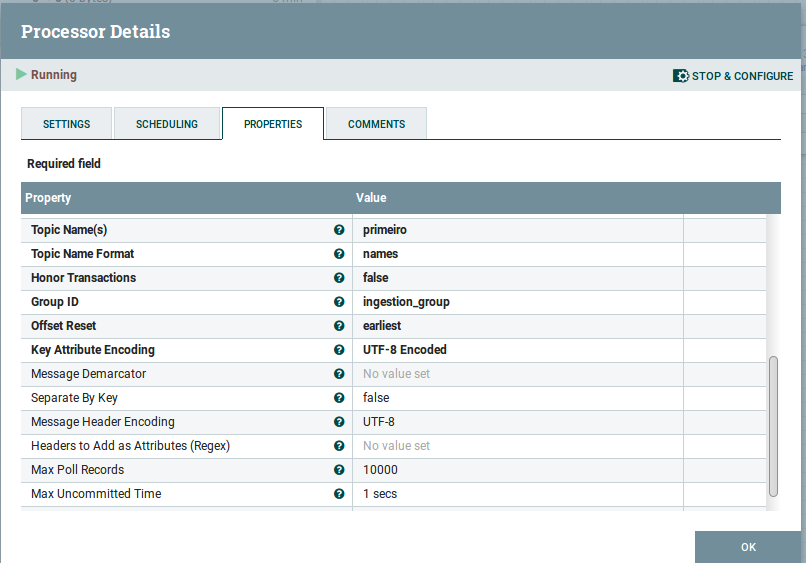

# Exercício NiFi
---
## Instruções

A entrega deste trabalho deverá ser um documento de evidências de execução dos exercícios solicitados em formato **pdf**. Para que as atividades estejam bem evidenciadas lembre de sempre apresentar os seguintes prints para todos os casos:

- Fluxo completo, onde se possa visualizar todos os _processors_ utilizados para compor a solução

- Configuração de cada _processor_ para que se possa avaliar os parâmetros utilizados

- Evidência do resultado da operação realizada que permita avaliar o resultado bem sucedido da execução do fluxo completo (como listagem no HDFS do diretório destino do fluxo, print de um terminal, etc.)

Lembre-se que a organização do trabalho entregue também é avaliada!

## Antes de iniciar:

Antes de iniciar as atividades propostas, é necessário alguns passos, conforme descrito abaixo:

### Iniciar Serviços do Hadoop

Certifique-se de que os seguintes serviços estejam rodando em sua VM com Hadoop:

- HDFS
- Zookeeper
- YARN
- MapReduce2
- Hive
- Kafka

### Instalar pacote Kite no NiFi
Nas versões atuais do NiFi, os _processors_ do pacote **kite** deixaram de ser distribuídos no pacote de instalação. Para executar uma das atividades, teremos que instalar o pacote manualmente no NiFi. Para a nossa sorte, esse processo limita-se a copiar o arquivo do pacote **kite** ao diretório de bibliotecas de sua instalação no NiFi.

**Observação**:  É muito importante que seja adicionado o arquivo do **kite** exatamente da mesma versão de sua instalação do NiFi. Caso as versões sejam incompatíveis, o pacote não passará na validação do processo de inicialização do NiFi, causando a interrupção do programa.

Para instalação do pacote **kite**, siga as seguintes instruções:

1. Rode o comando ``nifi.sh`` a partir do terminal para obter a versão e local de instalação do NiFi. No caso do exemplo abaixo, a versão instalada é a ``1.13.2`` e o local de instalação é ``/opt/nifi-1.13.2``:

    &nbsp;&nbsp;

2. A partir da sua VM, baixe o pacote binário do **kite** (nar) para a sua versão de NiFi. No caso da versão apresentada acima, o arquivo pode ser obtido diretamente do link abaixo:
   [nifi-kite-nar-1.13.2.nar](https://github.com/thiagonogueira/fiap/raw/main/abd/ingestao%20de%20dados/aula_nifi/bin/nifi-kite-nar-1.13.2.nar)

    Você também poderá encontrar outras versões do pacote no seguinte link:
    https://mvnrepository.com/artifact/org.apache.nifi/nifi-kite-nar

3. Copie o arquivo baixado para o subdiretório ``lib`` do local de instalação do NiFi. No caso apresentado acima, você poderá rodar o seguinte comando no terminal, considerando que o download foi feito no diretório padrão:
    > cp ~/Downloads/nifi-kite-nar-1.13.2.nar /opt/nifi-1.13.2/lib

### Iniciar o NiFi e acessá-lo através de um browser

Para iniciar o NiFI, rode o seguinte comando a partir do terminal:

> nifi.sh start

Aguarde alguns minutos até que o a plataforma suba e a interface web esteja disponível. Você poderá acessar o NiFi pelo browser através do link:

http://hdpdemo.local:18080/nifi/

Agora sim! Estamos prontos para iniciar as atividades!

## Exercícios

### 1. Ingestão de arquivos para um diretório no HDFS

Nesta atividade você deverá importar arquivos de vendas da sua empresa para o HDFS. Os arquivos estão em formato delimitado na origem e deverão ser salvos no mesmo formato no destino. Seguem parâmetros para criação do fluxo:

- **Diretório de origem:** /data/marketplace/sales/
- **Formato dos arquivos na origem:** arquivo delimitado
- **Delimitador**: |
- **Diretório de destino:** /data/bronze/sales/
- **Formato dos arquivos no destino:** preservar mesmo formato da origem
- **Compressão dos arquivos no destino**: Nenhuma

````
#adicione neste espaço suas evidências e comentários
````

#### Desafio 1:

Os usuários da tabela ``sales`` estão reclamando da performance da tabela está muito abaixo do esperado. Após alguns estudos, seu time resolve recriar a tabela na camada ``silver`` de seu datalake em formato ``orc``. Você deverá criar um processo no NiFi que leia os dados salvos do HDFS, converta-os para o formato ``orc`` e salve na camada silver. Adicionalmente, crie tabelas externas apontando para os dois diretórios, desenvolva uma query que apresente a o número total de operações e o valor total transacionado (soma de ``value``) para cada método de pagamento (coluna ``x_choice``) e compare o tempo de execução para cada um dos casos.

Para realizar o desafio, considere as seguintes informações:

- **Diretório de origem:** /data/bronze/sales/
- **Formato dos arquivos na origem:** arquivo delimitado
- **Delimitador**: |
- **Nome dos campos**:
    - account_id,
    - date_time,
    - transaction_id,
    - value,
    - x_stores,
    - x_category,
    - x_cities,
    - x_province,
    - x_choice
- **Diretório de destino:** /data/silver/sales/
- **Formato dos arquivos no destino:** orc
- **Compressão dos arquivos no destino**: Nenhuma


````
#adicione neste espaço suas evidências e comentários
````

### 2. Ingestão de uma tabela para um diretório no HDFS

Nesta atividade você deverá utilizar o NiFi para fazer a importação de uma tabela do banco de Dados para o HDFS. Para isso, você deverá utilizar o processor ``ExecuteSQL``.

Para a correta utilização deste _processor_ é necessária a criação de um **Database Connection Pooling Service**. Utilize a imagem abaixo como exemplo, e não se esqueça de adicionar usuário e senha do DB:


Para configuração do processo, utilize os seguintes dados de origem e destino:

- **Tabela de origem:** LOC_AGENCIA
- **Tipo de Carga:** Carga Full
- **Diretório de destino:** /data/bronze/carloca/loc_agencia/

**Importante:** Para evitar que a query rode continuamente, ajuste o parâmetro ``Run Schedule`` na aba SCHEDULING para **60s**. Isso permitirá que você faça uma validação da recorrência do processo sem gerar uma quantidade descontrolada de conexões simultâneas ao banco de dados.

````
#adicione neste espaço suas evidências e comentários
````

#### Desafio 2:

Desenvolva um processo que faça a ingestão de todas as tabelas do banco CARLOCA. Para isso você deverá encontrar um _processor_ que auxilie a listar todas as tabelas do banco. Vale também lembrar que as tabelas de interesse possuem sempre o prefixo ``LOC`` em seu nome.

````
#adicione neste espaço suas evidências e comentários
````
### 3. Ingestão de mensagens de um tópico kafka para o HDFS

Neste exercício utilizaremos um programa python simulador de logs para fazer a ingestão de registros de log de navegação no HDFS. Antes de iniciar a atividade, você deverá rodar o programa simulador de log em um terminal. Este programa escreve as entradas de log no tópico kafka ``weblogs``. Para desenvolver este fluxo, considere utilizar o _processor_ ``ConsumeKafka_2_6``. Utilize as imagens abaixo como exemplo para configuração:





O programa python pode ser obtido no seguinte link:
[log_generator-kafka.py](https://raw.githubusercontent.com/thiagonogueira/fiap/main/abd/ingestao%20de%20dados/aula_nifi/src/log_generator-kafka.py)

Para configuração do processo, utilize os seguintes dados de destino:


- **Diretório de destino:** /data/bronze/web/weblogs/

````
#adicione neste espaço suas evidências e comentários
````

#### Desafio 3:

Baseado no fluxo criado no item, desenvolva uma forma de filtrar apenas as mensagens do kafka que representem erro 404. Estes registros deverão ser enviados a um novo tópico kafka chamado ``weberrors``. Neste mesmo fluxo, adicione um processor que salve os dados no HDFS no diretório ``/data/web/weberrors``.

````
#adicione neste espaço suas evidências e comentários
````