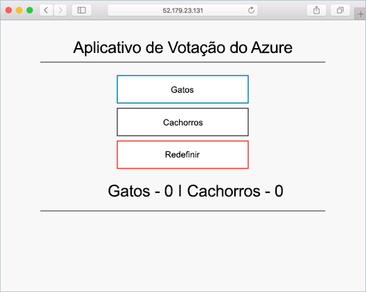
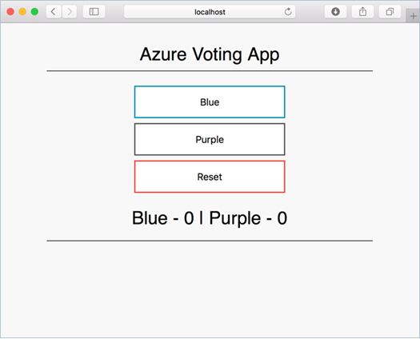

# Tutorial: Kubernetes no Azure Kubernetes Service (AKS)

Kubernetes fornece uma plataforma distribuída para aplicativos em contêineres. Com o AKS, você pode criar rapidamente um cluster do Kubernetes pronto para produção.

**Nota**: Este tutorial exige a execução da CLI do Azure versão 2.0.53 ou posterior. Execute az --version para encontrar a versão. Se você precisa instalar ou atualizar, consulte [Instalar a CLI do Azure](https://docs.microsoft.com/pt-br/cli/azure/install-azure-cli).
## 1. Preparar um aplicativo para o AKS

Nesta etapa do tutorial, um aplicativo de vários contêineres é preparado para uso em Kubernetes. As ferramentas de desenvolvimento existentes, como o Docker Compose, são usadas para compilar e testar aplicativos localmente. Você aprenderá como:

- Clonar a origem do aplicativo de exemplo do GitHub
- Criar uma imagem de contêiner a partir da origem do aplicativo de exemplo
- Testar o aplicativo de vários contêineres em um ambiente Docker local

Uma vez concluído, o seguinte aplicativo será executado em seu ambiente de desenvolvimento local:




### Obter o código do aplicativo

O aplicativo de exemplo usado neste tutorial é um aplicativo de votação básico. O aplicativo consiste de um componente Web de front-end e uma instância Redis de back-end. O componente Web é empacotado em uma imagem de contêiner personalizada. A instância Redis utiliza uma imagem não modificada do Hub Docker.

Use o git para clonar o aplicativo de exemplo para seu ambiente de desenvolvimento:

```
git clone https://github.com/thiagonogueira/azure-voting-app-redis.git
```

Altere para o diretório clonado.

```
cd azure-voting-app-redis
```

Dentro do diretório está o código-fonte do aplicativo, um arquivo Docker Compose pré-criado e um arquivo de manifesto Kubernetes. Esses arquivos são usados em todo o conjunto do tutorial.

### Criar imagens de contêiner

O Docker Compose pode ser usado para automatizar a compilação de imagens de contêiner e a implantação de aplicativos de vários contêineres.

Execute o arquivo docker-compose.yaml de exemplo para criar a imagem de contêiner, baixar a imagem Redis e iniciar o aplicativo:

```
docker-compose up -d
```

Quando completado, use o comando docker images para ver as imagens criadas. Três imagens foram bax'ixadas ou criadas. A imagem azure-vote-front contém o aplicativo de front-end e usa a imagem nginx-flask como base. A imagem redis é usada para iniciar uma instância do Redis.

```
$ docker images

REPOSITORY                                     TAG                 IMAGE ID            CREATED             SIZE
mcr.microsoft.com/azuredocs/azure-vote-front   v1                  84b41c268ad9        9 seconds ago       944MB
mcr.microsoft.com/oss/bitnami/redis            6.0.8               3a54a920bb6c        2 days ago          103MB
tiangolo/uwsgi-nginx-flask                     python3.6           a16ce562e863        6 weeks ago         944MB
```

Execute o comando docker ps para ver os contêineres em execução:

```
$ docker ps

CONTAINER ID        IMAGE                                             COMMAND                  CREATED             STATUS              PORTS                           NAMES
d10e5244f237        mcr.microsoft.com/azuredocs/azure-vote-front:v1   "/entrypoint.sh /sta…"   3 minutes ago       Up 3 minutes        443/tcp, 0.0.0.0:8080->80/tcp   azure-vote-front
21574cb38c1f        mcr.microsoft.com/oss/bitnami/redis:6.0.8         "/opt/bitnami/script…"   3 minutes ago       Up 3 minutes        0.0.0.0:6379->6379/tcp          azure-vote-back
```

### Testar o aplicativo localmente

Para ver o aplicativo em execução, insira http://localhost:8080 em um navegador da Web local. O aplicativo de exemplo é carregado, conforme mostra o exemplo a seguir:

**Nota**: Caso esteja rodando o aplicativo numa VM, você deverá criar uma regra no firewall para poder acessar a aplicação remotamente


### Limpar os recursos

Agora que a funcionalidade do aplicativo foi validada, os contêineres em execução podem ser interrompidos e removidos. Não exclua as imagens do contêiner. No próximo tutorial, a imagem azure-vote-front será carregada em uma instância do Registro de Contêiner do Azure.

Pare e remova as instâncias de contêiner e os recursos com o comando `docker-compose down`:


```
docker-compose down
```

Quando o aplicativo local tiver sido removido, você terá uma imagem do Docker que contém o aplicativo Azure Vote, azure-vote-front, para usar no próximo tutorial.

## 2. Implantar e usar o Registro de Contêiner do Azure

O ACR (Registro de Contêiner do Azure) é um registro particular de imagens de contêiner. Um registro de contêiner privado permite criar e implantar seus aplicativos e o código personalizado com segurança. Nesta etapa do tutorial, você pode implantar uma instância do ACR e enviar por push uma imagem de contêiner a ele. Você aprenderá como:

- Criar uma instância do Registro de Contêiner do Azure (ACR)
- Marcar uma imagem de contêiner para ACR
- Carregar a imagem para ACR
- Exibir imagens no seu registro

Posteriormente, essa instância do ACR será integrada a um cluster do Kubernetes no AKS e um aplicativo será implantado com base na imagem.

### Criar um Registro de Contêiner do Azure

Para criar um Registro de Contêiner do Azure, primeiro você precisa de um grupo de recursos. Um grupo de recursos do Azure é um contêiner lógico no qual os recursos do Azure são implantados e gerenciados.

Crie um grupo de recursos com o comando az group create. No exemplo a seguir, um grupo de recursos chamado *myResourceGroup* é criado na região *eastus*:

```
az group create --name myResourceGroup --location eastus
```

Crie uma instância do Registro de Contêiner do Azure com o comando az acr create e forneça seu próprio nome de registro. O nome do registro deve ser exclusivo no Azure e conter de 5 a 50 caracteres alfanuméricos. No restante deste tutorial, <acrName> é usado como um espaço reservado para o nome do registro de contêiner. Forneça seu próprio nome de registro exclusivo. A SKU Basic é um ponto de entrada de otimização de custo para fins de desenvolvimento que fornece um equilíbrio entre o armazenamento e taxa de transferência.

```
az acr create --resource-group myResourceGroup --name <acrName> --sku Basic
```

### Logon no registro de contêiner

Para usar a instância do ACR, você deve primeiro fazer logon. Use o comando az acr login e forneça o nome exclusivo especificado para o registro de contêiner na etapa anterior.

```
az acr login --name <acrName>
```

O comando retorna uma mensagem de Logon bem-sucedido quando é concluído.

**Nota**: Caso o comando dê um erro, tente rodar os seguintes comandos e repita a opração anterior:

```
sudo apt-get purge docker-credential-pass
sudo apt -V install gnupg2 pass
```

### Marcar uma imagem de contêiner

Para ver uma lista das imagens locais atuais, use o comando docker images:

```
$ docker images
```

A saída de comando acima mostra a lista de suas imagens locais atuais:

```
REPOSITORY                                     TAG                 IMAGE ID            CREATED             SIZE
mcr.microsoft.com/azuredocs/azure-vote-front   v1                  84b41c268ad9        7 minutes ago       944MB
mcr.microsoft.com/oss/bitnami/redis            6.0.8               3a54a920bb6c        2 days ago          103MB
tiangolo/uwsgi-nginx-flask                     python3.6           a16ce562e863        6 weeks ago         944MB
```

Para usar a imagem de contêiner azure-vote-front com o ACR, a imagem precisa ser marcada com o endereço do servidor de logon do seu registro. Essa marca é usada para roteamento ao enviar imagens de contêiner por push a um registro da imagem.

Para obter o endereço do servidor de logon, use o comando az acr list e consulte o loginServer da seguinte maneira:

```
az acr list --resource-group myResourceGroup --query "[].{acrLoginServer:loginServer}" --output table
```

Agora, marque a imagem local azure-vote-front com o endereço acrLoginServer do registro de contêiner. Para indicar a versão da imagem, adicione :v1 no final do nome da imagem:

```
docker tag mcr.microsoft.com/azuredocs/azure-vote-front:v1 <acrLoginServer>/azure-vote-front:v1
```

Para verificar se as marcas foram aplicadas, execute docker images novamente.

```
$ docker images
```

Uma imagem é marcada com o endereço de instância do ACR e um número de versão.

```
REPOSITORY                                      TAG                 IMAGE ID            CREATED             SIZE
mcr.microsoft.com/azuredocs/azure-vote-front    v1                  84b41c268ad9        16 minutes ago      944MB
mycontainerregistry.azurecr.io/azure-vote-front v1                  84b41c268ad9        16 minutes ago      944MB
mcr.microsoft.com/oss/bitnami/redis             6.0.8               3a54a920bb6c        2 days ago          103MB
tiangolo/uwsgi-nginx-flask                      python3.6           a16ce562e863        6 weeks ago         944MB
```

### Efetuar push de imagens para registro

Com a imagem criada e marcada, envie por push a imagem azure-vote-front para a instância do ACR. Use docker push e forneça seu próprio endereço do acrLoginServer para o nome da imagem da seguinte maneira:

```
docker push <acrLoginServer>/azure-vote-front:v1
```

A conclusão do envio por push da imagem para o ACR pode levar alguns minutos.

### Lista de imagens no registro

Para retornar uma lista das imagens que foram enviadas por push para a instância do ACR, use o comando az acr repository list. Forneça seu próprio <acrName> da seguinte maneira:
CLI do Azure

```
az acr repository list --name <acrName> --output table
```

A saída de exemplo a seguir lista a imagem azure-vote-front como disponível no registro:

```
Result
----------------
azure-vote-front
```

Para ver as marcas para uma imagem específica, use o comando az acr repository show-tags da seguinte maneira:

```
az acr repository show-tags --name <acrName> --repository azure-vote-front --output table
```

A saída de exemplo a seguir mostra a imagem v1 marcada em uma etapa anterior:

```
Result
--------
v1
```

Agora você tem uma imagem de contêiner que é armazenada em uma instância privada de Registro de Contêiner do Azure. Essa imagem é implantada do ACR para um cluster Kubernetes no próximo tutorial.

## 3. Implantar um cluster do AKS (Serviço de Kubernetes do Azure)


Nesta etapa do tutorial, um cluster Kubernetes é implantado no AKS. Você aprenderá como:

- Implantar um cluster Kubernetes do AKS que possa se autenticar em um Registro de Contêiner do Azure
- Instalar a CLI Kubernetes (kubectl)
- Configurar o kubectil para conectar-se ao cluster AKS

Posteriormente, o aplicativo Azure Vote será implantado no cluster, dimensionado e atualizado.

### Criar um cluster do Kubernetes

Os cluster AKS podem usar o RBAC (controle de acesso baseado em função) do Kubernetes. Esses controles permitem que você defina o acesso a recursos com base em funções atribuídas aos usuários. As permissões são combinadas se um usuário recebe várias funções e podem ter o escopo definido para um único namespace ou todo o cluster. Por padrão, a CLI do Azure habilita o RBAC automaticamente quando você cria um cluster AKS.

Crie um cluster AKS usando az `aks create`. O exemplo abaixo cria um cluster chamado *myAKSCluster* no grupo de recursos chamado *myResourceGroup*. Esse grupo de recursos foi criado no tutorial anterior na região *eastus*. Para permitir a interação de um cluster AKS com outros recursos do Azure, uma entidade de serviço do Azure Active Directory é criada automaticamente, já que você não especificou uma. Aqui, a essa entidade de serviço é concedido o direito de efetuar pull de imagens da instância do ACR (Registro de Contêiner do Azure) que você criou na etapa enterior do tutorial.

```
az aks create \
    --resource-group myResourceGroup \
    --name myAKSCluster \
    --node-count 2 \
    --generate-ssh-keys \
    --attach-acr <acrName>
```

Após alguns minutos, a implantação será concluída e retornará informações no formato JSON sobre a implantação do AKS.

**Observação**: Para verificar se seu cluster opera de maneira confiável, execute pelo menos 2 (dois) nós.

### Instalar a CLI Kubernetes

Para se conectar ao cluster Kubernetes no computador local, use o kubectl, o cliente de linha de comando do Kubernetes.
Se você usa o Azure Cloud Shell, o kubectl já estará instalado. Se você quiser instalá-lo localmente, use o comando az aks install-cli:

```
sudo az aks install-cli
```

### Conectar-se ao cluster usando o kubectl

Para configurar o kubectl para se conectar ao cluster do Kubernetes, use o comando az aks get-credentials. O seguinte exemplo obtém as credenciais para o cluster do AKS chamado myAKSCluster no myResourceGroup:

```
az aks get-credentials --resource-group myResourceGroup --name myAKSCluster
```

Para verificar a conexão com o cluster, execute o comando kubectl get nodes para retornar uma lista dos nós de cluster:

```
$ kubectl get nodes

NAME                       STATUS   ROLES   AGE   VERSION
aks-nodepool1-12345678-0   Ready    agent   32m   v1.14.8
```

## 4. Executar aplicativos no AKS (Serviço de Kubernetes do Azure)


Nesta etapa do tutorial, um aplicativo de exemplo é implantado em um cluster Kubernetes. Você aprenderá como:

- Atualizar um arquivo de manifesto do Kubernetes
- Executar um aplicativo no Kubernetes
- Testar o aplicativo


### Atualizar o arquivo de manifesto

Nesses tutoriais, uma instância de Registro de Contêiner do Azure (ACR) armazena a imagem de contêiner para o aplicativo de exemplo. Para implantar o aplicativo, você deve atualizar o nome da imagem no arquivo de manifesto do Kubernetes para incluir o nome do servidor de logon do ACR.

Obtenha o nome do servidor de logon do ACR usando o comando az acr list da seguinte maneira:

```
az acr list --resource-group myResourceGroup --query "[].{acrLoginServer:loginServer}" --output table
```

O arquivo de manifesto de exemplo do repositório git clonado na primeira etapa do tutorial usa o nome do servidor de logon microsoft. Verifique se você está no diretório azure-votação-aplicativo-redis clonado e, em seguida, abra o arquivo de manifesto com um editor de texto, como `nano`:

```
nano azure-vote-all-in-one-redis.yaml
```

Substitua microsoft pelo seu nome de servidor de logon do ACR. Esse valor pode ser encontrado na linha 60 do arquivo de manifesto. O seguinte exemplo mostra o nome da imagem padrão:

```
containers:
- name: azure-vote-front
  image: mcr.microsoft.com/azuredocs/azure-vote-front:v1
```

Forneça seu próprio nome de servidor de logon do ACR para que o arquivo de manifesto se pareça com o exemplo a seguir:

```
containers:
- name: azure-vote-front
  image: <acrName>.azurecr.io/azure-vote-front:v1
```

Salve e feche o arquivo.

### Implantar o aplicativo

Para implantar o aplicativo, use o comando kubectl apply. Esse comando analisa o arquivo de manifesto e cria objetos Kubernetes definidos. Especifique o arquivo de manifesto de exemplo, conforme mostrado no exemplo a seguir:

```
kubectl apply -f azure-vote-all-in-one-redis.yaml
```

A saída de exemplo a seguir mostra os recursos criados com êxito no cluster AKS:

```
$ kubectl apply -f azure-vote-all-in-one-redis.yaml

deployment "azure-vote-back" created
service "azure-vote-back" created
deployment "azure-vote-front" created
service "azure-vote-front" created
```

### Testar o aplicativo

Quando o aplicativo é executado, um serviço de Kubernetes expõe o front-end do aplicativo à Internet. A conclusão desse processo pode levar alguns minutos.

Para monitorar o andamento, use o comando kubectl get service com o argumento --watch.

```
kubectl get service azure-vote-front --watch
```

Inicialmente, o EXTERNAL-IP para o serviço azure-vote-front é mostrado como pendente:

```
azure-vote-front   LoadBalancer   10.0.34.242   <pending>     80:30676/TCP   5s
```

Quando o endereço EXTERNAL-IP for alterado de pendente para um endereço IP público real, use CTRL-C para interromper o processo de inspeção do kubectl. A seguinte saída de exemplo mostra um endereço IP público válido atribuído ao serviço:

```
azure-vote-front   LoadBalancer   10.0.34.242   52.179.23.131   80:30676/TCP   67s
```

Para ver o aplicativo em ação, abra um navegador da Web no endereço IP externo do seu serviço:


## 5. Dimensionar aplicativos no AKS (Serviço de Kubernetes do Azure)

Nesta etapa do tutorial, você escalará horizontalmente os pods no aplicativo e experimentará o dimensionamento automático do pod. Você também aprenderá como dimensionar o número de nós da VM do Azure para alterar a capacidade do cluster para hospedagem de cargas de trabalho. Você aprenderá como:

- Dimensionar pods Kubernetes manualmente que executam seu aplicativo
- Configurar os pods para dimensionamento automático
- Dimensionar os nós Kubernetes

### Dimensionar pods manualmente

Quando a instância do Redis e o front-end do Azure Vote foram implantados nos tutoriais anteriores, uma única réplica foi criada. Para ver o número e o estado de pods no cluster, use o comando kubectl get da seguinte maneira:

```
kubectl get pods
```

A saída de exemplo a seguir mostra um pod de front-end e um pod de back-end:

```
NAME                               READY     STATUS    RESTARTS   AGE
azure-vote-back-2549686872-4d2r5   1/1       Running   0          31m
azure-vote-front-848767080-tf34m   1/1       Running   0          31m
```

Para alterar manualmente o número de pods na implantação azure-vote-front, use o comando kubectl scale. O exemplo a seguir aumenta o número de pods de front-end 5:Console

```
kubectl scale --replicas=5 deployment/azure-vote-front
```

Execute kubectl get pods novamente para verificar se o AKS cria os pods adicionais. Após aproximadamente um minuto, os pods adicionais estão disponíveis em seu cluster:

```
kubectl get pods

                                    READY     STATUS    RESTARTS   AGE
azure-vote-back-2606967446-nmpcf    1/1       Running   0          15m
azure-vote-front-3309479140-2hfh0   1/1       Running   0          3m
azure-vote-front-3309479140-bzt05   1/1       Running   0          3m
azure-vote-front-3309479140-fvcvm   1/1       Running   0          3m
azure-vote-front-3309479140-hrbf2   1/1       Running   0          15m
azure-vote-front-3309479140-qphz8   1/1       Running   0          3m
```

### Dimensionamento automático de pods

O Kubernetes dá suporte a dimensionamento automático horizontal de pods, permitindo ajustar o número de pods em uma implantação dependendo da utilização da CPU ou de outras métricas selecionadas. O Servidor de Métricas é usado para fornecer a utilização de recursos para Kubernetes e é implantado automaticamente em clusters AKS versões 1.10 e superior. Para ver a versão do cluster do AKS, use o comando az aks show conforme mostrado no exemplo a seguir:
CLI do Azure

```
az aks show --resource-group myResourceGroup --name myAKSCluster --query kubernetesVersion --output table
```

Para usar o dimensionador automático, todos os contêineres em seus pods devem ter limites e solicitações de CPU definidos. Na implantação, azure-vote-front o contêiner de front-end já solicita 0,25 CPU, com um limite de 0,5 CPU. Essas solicitações e limites de recursos são definidos como mostrado no snippet de exemplo a seguir:

```
resources:
  requests:
     cpu: 250m
  limits:
     cpu: 500m
```

O exemplo a seguir usa o comando kubectl autoscale para dimensionar automaticamente o número de pods na implantação azure-vote-front. Se a utilização média da CPU entre todos os pods exceder 50% do seu uso solicitado, o dimensionamento automático aumentará os pods até um máximo de 10 instâncias. Um mínimo de 3 instâncias então é definido para a implantação:

```
kubectl autoscale deployment azure-vote-front --cpu-percent=50 --min=3 --max=10
```

Como alternativa, você poderia também criar um arquivo de manifesto para definir o comportamento do dimensionador automático e os limites de recursos. Veja a seguir o exemplo de um arquivo de manifesto chamado azure-vote-hpa.yaml.

```
apiVersion: autoscaling/v1
kind: HorizontalPodAutoscaler
metadata:
  name: azure-vote-back-hpa
spec:
  maxReplicas: 10 # define max replica count
  minReplicas: 3  # define min replica count
  scaleTargetRef:
    apiVersion: apps/v1
    kind: Deployment
    name: azure-vote-back
  targetCPUUtilizationPercentage: 50 # target CPU utilization

---

apiVersion: autoscaling/v1
kind: HorizontalPodAutoscaler
metadata:
  name: azure-vote-front-hpa
spec:
  maxReplicas: 10 # define max replica count
  minReplicas: 3  # define min replica count
  scaleTargetRef:
    apiVersion: apps/v1
    kind: Deployment
    name: azure-vote-front
  targetCPUUtilizationPercentage: 50 # target CPU utilization
```

Neste caso, para aplicar o dimensionador automático definido no arquivo de manifesto azure-vote-hpa.yaml utilize o comando kubectl apply:

```
kubectl apply -f azure-vote-hpa.yaml
```

Para ver o status do dimensionador automático, use o comando kubectl get hpa da seguinte forma:

```
kubectl get hpa

NAME               REFERENCE                     TARGETS    MINPODS   MAXPODS   REPLICAS   AGE
azure-vote-front   Deployment/azure-vote-front   0% / 50%   3         10        3          2m
```

Após alguns minutos, com carga mínima no aplicativo Azure Vote, o número de réplicas de pod diminui automaticamente para três. Você pode usar kubectl get pods novamente para ver os pods desnecessários que está sendo removidos.

### Dimensionar nós do AKS manualmente
Se você criou o cluster Kubernetes usando os comandos deste tutorial, ele tem dois nós. Você pode ajustar o número de nós manualmente se planejar ter mais ou menos cargas de trabalho de contêiner no cluster.

O exemplo a seguir aumenta o número de nós para três no cluster Kubernetes chamado myAKSCluster. Esse comando leva alguns minutos para ser concluído.

```
az aks scale --resource-group myResourceGroup --name myAKSCluster --node-count 3
```

Quando o cluster tiver sido dimensionado com êxito, a saída será semelhante ao exemplo a seguir:

```
"agentPoolProfiles": [
  {
    "count": 3,
    "dnsPrefix": null,
    "fqdn": null,
    "name": "myAKSCluster",
    "osDiskSizeGb": null,
    "osType": "Linux",
    "ports": null,
    "storageProfile": "ManagedDisks",
    "vmSize": "Standard_D2_v2",
    "vnetSubnetId": null
  }
```
## 6. atualizar um aplicativo no Serviço de Kubernetes do Azure (AKS)

Depois que um aplicativo foi implantado no Kubernetes, ele pode ser atualizado especificando uma nova imagem de contêiner ou versão de imagem. Uma atualização é preparada para que apenas uma parte da implantação seja atualizada ao mesmo tempo.

Essa atualização em etapas permite que o aplicativo continue em execução durante a atualização. Ela também oferece um mecanismo de reversão, caso ocorra uma falha de implantação.

Nesta etapa do tutorial, o aplicativo de exemplo Azure Vote é atualizado. Você aprenderá como:

- Atualizar o código do aplicativo front-end
- Criar uma imagem de contêiner atualizada
- Efetuar push da imagem de contêiner para o Registro de Contêiner do Azure
- Implantar a imagem de contêiner atualizada

### Atualizar um aplicativo

Vamos fazer uma alteração no aplicativo de exemplo e, em seguida, atualize a versão já implantada no cluster do AKS. Verifique se você está no diretório azure-voting-app-redis clonado. O código-fonte do aplicativo de exemplo pode então ser encontrado no diretório azure-vote. Abra o arquivo config_file.cfg do arquivo com um editor, como nano:

```
nano azure-vote/azure-vote/config_file.cfg
```

Altere os valores de VOTE1VALUE e VOTE2VALUE para valores diferentes, como cores. O seguinte exemplo mostra os valores atualizados:

```
# UI Configurations
TITLE = 'Azure Voting App'
VOTE1VALUE = 'Blue'
VOTE2VALUE = 'Purple'
SHOWHOST = 'false'
```

Salve e feche o arquivo.

### Atualizar a imagem do contêiner

Para recriar a imagem de front-end e testar o aplicativo atualizado, use docker-compose. O argumento --build é usado para instruir o Docker Compose a recriar a imagem do aplicativo:

```
docker-compose up --build -d
```

### Testar o aplicativo localmente
Para verificar que a atualização imagem de contêiner atualizada mostra as alterações, abra um navegador da Web local para http://localhost:8080.



Os valores atualizados fornecidos no arquivo config_file.cfg são exibidos no aplicativo em execução.

### Marcar e enviar imagem por push

Para usar corretamente a imagem atualizada, marque a imagem azure-vote-front com o nome do servidor de logon do registro do ACR. Obter o nome do servidor de logon com o comando az acr list:

```
az acr list --resource-group myResourceGroup --query "[].{acrLoginServer:loginServer}" --output table
```

Utilize a docker tag para marcar a imagem. Substitua `acrLoginServer` pelo nome do servidor de logon do ACR ou pelo nome de host do registro público e atualize a versão da imagem para :v2 da seguinte maneira:

```
docker tag mcr.microsoft.com/azuredocs/azure-vote-front:v1 <acrLoginServer>/azure-vote-front:v2
```

Agora use docker push para fazer upload da imagem no registro. Substitua <`acrLoginServer`> pelo nome do servidor de logon do ACR.

**Observação**:  Se você tiver problemas de push para o registro do ACR, verifique se você ainda está conectado. Execute o comando az acr login usando o nome do Registro de Contêiner do Azure criado na etapa Criar um Registro de Contêiner do Azure. Por exemplo, az acr login --name <azure container registry name>.

```
docker push <acrLoginServer>/azure-vote-front:v2
```

### Implantar o aplicativo atualizado

Para fornecer o tempo de atividade máximo, várias instâncias do pod de aplicativos precisam estar em execução. Verifique o número de instâncias de front-end em execução com o comando kubectl get pods:

```
$ kubectl get pods

NAME                               READY     STATUS    RESTARTS   AGE
azure-vote-back-217588096-5w632    1/1       Running   0          10m
azure-vote-front-233282510-b5pkz   1/1       Running   0          10m
azure-vote-front-233282510-dhrtr   1/1       Running   0          10m
azure-vote-front-233282510-pqbfk   1/1       Running   0          10m
```

Caso não tenha vários pods de front-end, dimensione a implantação do azure-vote-front da seguinte maneira:

```
kubectl scale --replicas=3 deployment/azure-vote-front
```

Para atualizar o aplicativo, utilize o comando kubectl set. Atualize <`acrLoginServer`> com o servidor de logon ou com o nome do host do registro de contêiner e especifique a versão do aplicativo v2:

```
kubectl set image deployment azure-vote-front azure-vote-front=<acrLoginServer>/azure-vote-front:v2
```

Para monitorar a implantação, use o comando kubectl get pod. Conforme o aplicativo atualizado é implantado, os pods são encerrados e recriados com a nova imagem de contêiner.

```
kubectl get pods
```

A saída de exemplo a seguir mostra os pods de finalização e as novas instâncias em execução conforme o andamento da implantação:

```
$ kubectl get pods

NAME                               READY     STATUS        RESTARTS   AGE
azure-vote-back-2978095810-gq9g0   1/1       Running       0          5m
azure-vote-front-1297194256-tpjlg  1/1       Running       0          1m
azure-vote-front-1297194256-tptnx  1/1       Running       0          5m
azure-vote-front-1297194256-zktw9  1/1       Terminating   0          1m
```

### Testar o aplicativo atualizado
Para exibir o aplicativo de atualização, primeiro obtenha o endereço IP externo do serviço azure-vote-front:

```
kubectl get service azure-vote-front
```

Agora abra um navegador da Web local no endereço IP do serviço:

