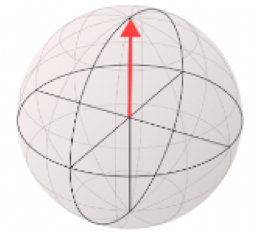
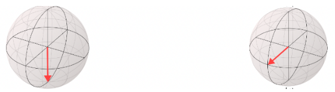
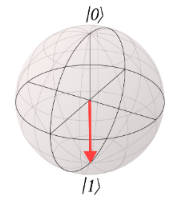
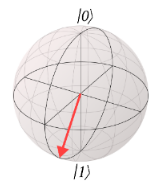
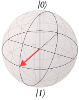
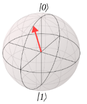

# Exercício 1 - Primeiro contato com Qubits

## Instruções

Complete os execícios abaixos e submeta no portal. Cada grupo deverá entregar 1 exercício

## Exercícios

1. Baseado na notação vista em aula, qual das opções abaixo representa um estado quântico:

    - [ ] i
    - [ ] |i>
    - [ ] (i)
    - [ ] [i]

2. Como é chamada a notação utilizada na questão anterior?

    - [ ] bit
    - [ ] complexa
    - [ ] set
    - [ ] ket

3. A esfera de Bloch é utilizada para representar qual aspecto da computação quântica?

    - [ ] Estados Quânticos
    - [ ] Circuitos Quânticos
    - [ ] Algoritmos Quânticos
    - [ ] Bits Clássicos

4. Qual estado é representado na esfera de Block abaixo?

    

    - [ ] |0>
    - [ ] |1>
    - [ ] |+>
    - [ ] |->

5. Considere as esferas de Bloch abaixo e responda qual estado representa cada uma delas:

    

    - Esfera da esquerda:
    - Esfera da direita:

6. Qual das esferas de Bloch abaixo representam a probabilidade de 70% de se medir |0> e 30% de se medir |1>?
    - [ ] 
    - [ ] 
    - [ ] 
    - [ ] 

7. Eu possuo um qubit no estado |0> e desejo alterá-lo para o estado |1>. Qual porta devo utilizar?

    - [ ] H
    - [ ] X
    - [ ] H e X
    - [ ] Nenhuma das portas acima farão esta operação

8. E possuo um qubit no estado |1> e gostaria de colocá-lo numa combinação de |0> e |1>. Qual das portas possui este efeito?

    - [ ] X
    - [ ] H
    - [ ] Nenhuma das portas acima farão esta operação
    - [ ] QUalquer uma das duas fará esta operação

9. Na questão anterior, qual fenômeno quântico foi gerado após a operação?

    - [ ] Emaranhamento
    - [ ] Tunelamento
    - [ ] Teleporte
    - [ ] Superposição

10. As operações realizadas por portas quânticas podem ser visualizadas como ______ na esfera de Bloch.

    - [ ] Rotações
    - [ ] Distorções
    - [ ] Ampliações
    - [ ] Contrações

11. As portas X realizam uma rotação de 180º em torno do eixo X na esfera de Bloch.

    - [ ] Verdadeiro
    - [ ] Falso

12. Qiskit é uma ______ do python:

    - [ ] Varável
    - [ ] Biblioteca
    - [ ] Dicionário

13. Dado um qubit no estado |1>, qual(is) operação(ões) levarão ao estado |0>?

    - [ ] H
    - [ ] X
    - [ ] H e X
    - [ ] X e H

14. Dado um qubit no estado |1>, qual(is) operação(ões) levarão ao estado |+>?

    - [ ] H
    - [ ] X
    - [ ] H e X
    - [ ] X e H

15. Dado um qubit no estado |->, qual(is) operação(ões) levarão ao estado |0>?

    - [ ] H
    - [ ] X
    - [ ] H e X
    - [ ] X e H

16. Dado um qubit no estado |->, qual(is) operação(ões) levarão ao estado |+>?

    - [ ] H
    - [ ] X
    - [ ] H e X
    - [ ] X e H

